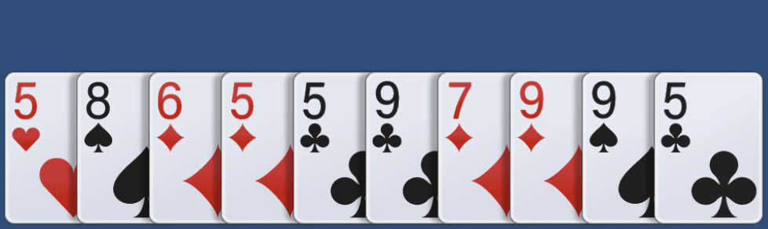
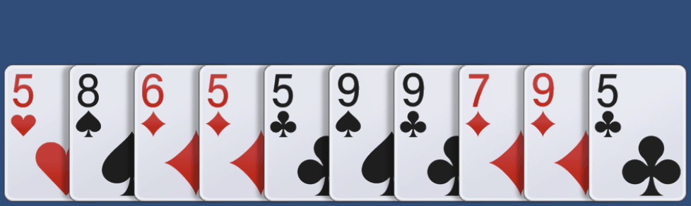
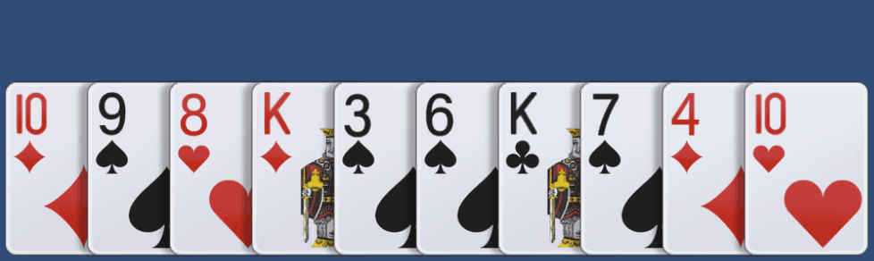

# Interview2022_2

**Basic Tasks**

1. Add card selecting and deselecting feature.
- On select, move the card up for certain time.
- On deselect, move the card down instantly.

2. Add card dragging feature.
- On drag start, move the card up instantly.
- On dragging, fix the y position of the card.
- When the dragging card gets closer to another card, move the position of the other card toward the dragging card.
- On drag end, move the card down instantly.

**Additional Tasks**

1. Add card scaling feature.
- Whenever a card is selected, the selected card and adjacent cards should be scaled up and moved up.

2. Add card sorting feature.
- Add card info to cards (number and type).
- Add random card setting button and sorting button.
- Sort cards in ascending order by number first, and then by type.
- Sort order :
(1 < 2 < 3 < 4 < 5 < 6 < 7 < 8 < 9 < 10 < J < Q < K)
(Diamond < Clover < Heart < Spade)

Need help? Email <u>qqas1211@naver.com</u>.
